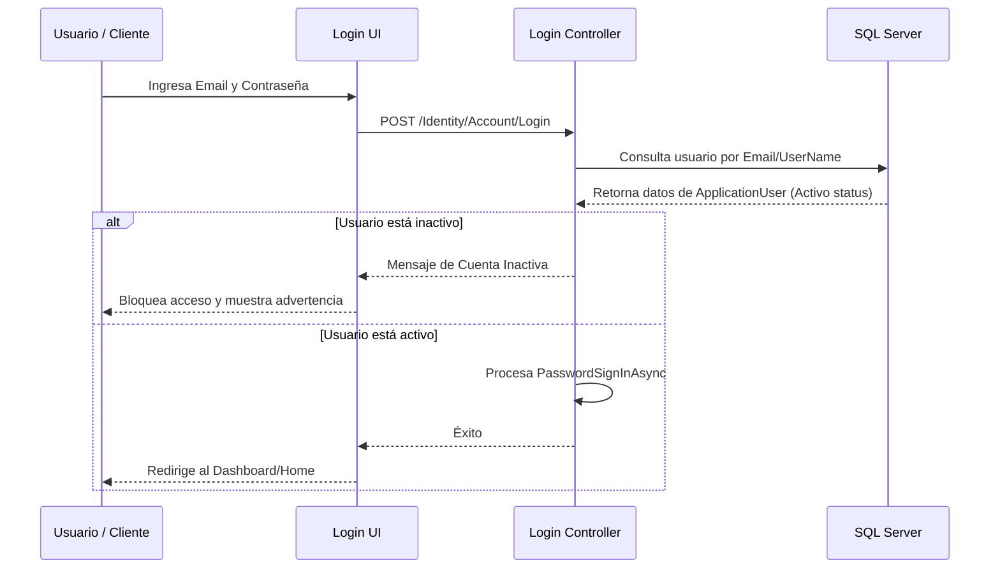

# DISEÑO DE SOLUCIÓN (DESIGN) - Correcciones de Configuración, Usuarios y POS

Este documento detalla la arquitectura, diagramas de flujo y diseño técnico de las correcciones implementadas en FashionStoreSolution.

---

## 1. Diseño de Interfaz de Configuración del Sistema
- **Layout**: Se añade un encabezado dinámico con título `<h1>`, descripción y un botón elegante `Volver a Inicio` con el icono `fa-home`.
- **Estructura de Pestañas**:
  1. **Branding**: Modificación de Nombre de Tienda, subida y validación en tiempo real del logotipo (Max 5MB, formatos `.jpg`, `.jpeg`, `.png`, `.webp`).
  2. **Temas**: Selección de estilos de colores predeterminados.
  3. **Datos de Negocio**: RUC, Dirección, Correo de la Tienda, Teléfono y Texto Pie de Página.
  4. **Usuarios y Accesos**: Listado de usuarios en tabla Bootstrap, botones de activación/desactivación y modal para crear usuarios (Administrador / Vendedor).
  5. **Descuentos Autorizados**: Formulario de creación de descuentos (Porcentaje o Soles) y listado interactivo.

---

## 2. Diagrama de Seguridad y Flujo de Login

---

## 3. Cambios en Modelos y Entidades

- **ApplicationUser** ([ApplicationUser.cs](file:///c:/Users/CRISTIAN/source/repos/FashionStoreSolution/FashionStore.Domain/Entities/ApplicationUser.cs)):
  - Se añade la propiedad `public bool Activo { get; set; } = true;`.
- **Cliente** ([Cliente.cs](file:///c:/Users/CRISTIAN/source/repos/FashionStoreSolution/FashionStore.Domain/Entities/Cliente.cs)):
  - Se añade la propiedad `public string? Email { get; set; }` con validación `[EmailAddress]` en [ClienteDTO.cs](file:///c:/Users/CRISTIAN/source/repos/FashionStoreSolution/FashionStore.Domain/DTOs/ClienteDTO.cs).

---

## 4. Diseño del Buscador del POS y Cobro
- **Autocomplete Ampliado**:
  - En lugar de un listado simple de texto, se genera un contenedor AJAX absoluto debajo de la barra de búsqueda que despliega tarjetas con la imagen del producto, precio, talla/color y stock.
- **Carrito y cantidades**:
  - Un objeto Javascript centralizado mantiene los ítems añadidos. Los inputs de cantidad validan el stock en tiempo real mediante llamadas al backend.
- **Aplicación de Descuentos**:
  - Un select de descuentos autorizados (cargados en `ViewBag.Descuentos` o serializados en el View Model) permite elegir el descuento por porcentaje o soles.
  - Al procesar la compra, se envía el ID del descuento seleccionado. El backend recalcula y valida contra la base de datos para prevenir manipulaciones maliciosas.
